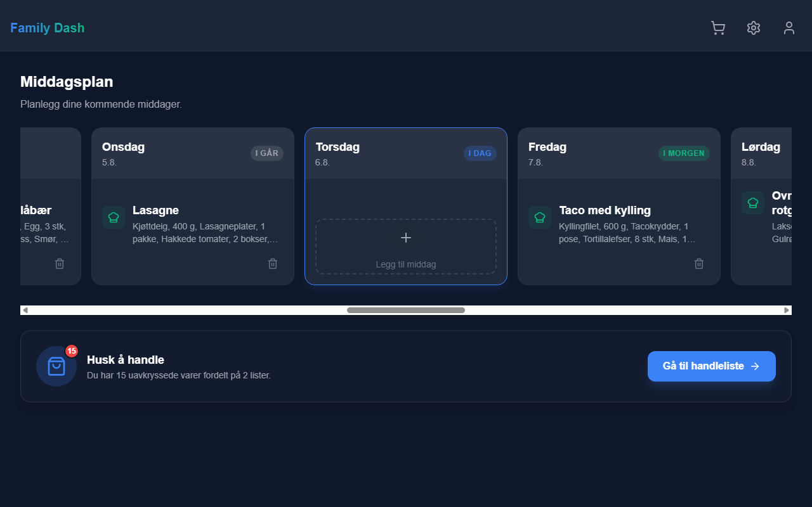
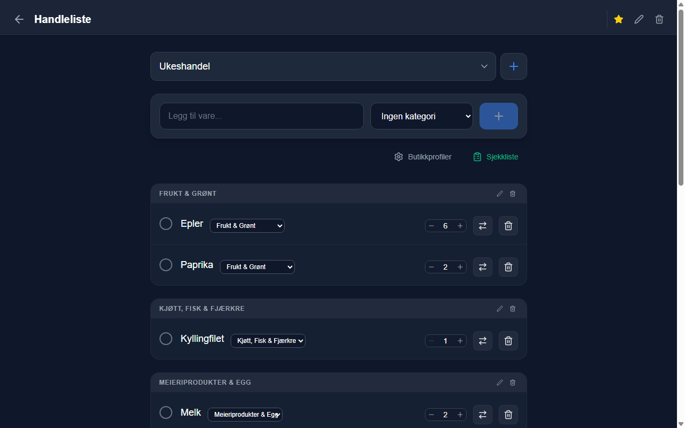
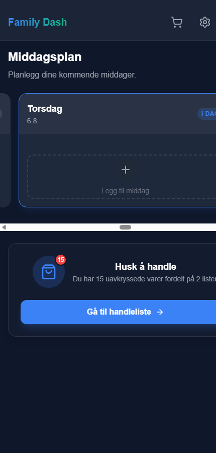

# Family Dash

Et delt dashboard for familien: planlegg ukens middager, hold handlelisten oppdatert i sanntid og kryss av felles gjøremål — på mobil, nettbrett og desktop.



## Funksjoner

- **Middagsplanlegging** — ukesvisning der middager legges til fra et gjenbrukbart arkiv. Lim inn en hel oppskrift som tekst, så parses rett, ingredienser, porsjoner, tid og fremgangsmåte automatisk, og et matchende bilde hentes fra Unsplash (norske retter oversettes til engelsk for bedre treff).
- **Kokkemodus** — stegvis visning av oppskriften med ingrediensliste og timer, tilpasset et kjøkken med skitne fingre.
- **Handleliste i sanntid** — flere lister, varer gruppert i kategorier, antall og avkryssing synkroniseres mellom alle familiemedlemmer via Firestore.
- **Butikkprofiler** — definer rekkefølgen på kategoriene slik *din* butikk er organisert, og bruk butikkmodus for å gå gjennom listen hylle for hylle. Appen husker hvilken kategori en vare sist ble plassert i.
- **Sjekklister** — felles gjøremål organisert i seksjoner.
- **Familiedeling** — opprett en familie og inviter andre med en kode. Innlogging med e-post/passord eller Google.
- **Flerspråklig** — norsk, engelsk, dansk, svensk, tysk, fransk, spansk og arabisk (med RTL-layout).
- **Android-app** — pakket med Capacitor i tillegg til web.

| Handleliste | Mobil |
| --- | --- |
|  |  |

## Teknologi

- **React 19** + **Vite 7**, **Tailwind CSS**, **framer-motion**, **lucide-react**
- **Firebase**: Authentication, Cloud Firestore (sanntidssynkronisering), Hosting
- **Capacitor 8** for Android-innpakning
- **i18next** for internasjonalisering

## Prøv demoen — uten oppsett

Appen har en innebygd demo-modus med en fiktiv familie og syntetiske data (ukeplaner genereres relativt til dagens dato). Ingen Firebase-konfigurasjon trengs:

```bash
git clone https://github.com/torbmelb88/family-dash.git
cd family-dash
npm install
npm run dev
```

Åpne <http://localhost:5173> og klikk **«Prøv demo med testdata»** — eller gå rett til `http://localhost:5173/?demo=1`.

Demo-modusen fungerer ved at all data- og autentiseringstilgang går gjennom én fasade ([src/services/backend.js](src/services/backend.js)). Når Firebase ikke er konfigurert (eller demo er aktivert), byttes Firestore/Auth ut med en liten in-memory-implementasjon av det samme API-et ([src/services/demoBackend.js](src/services/demoBackend.js)) — resten av appen er uendret og vet ikke at den kjører mot testdata.

## Kjøre med egen Firebase

1. Opprett et Firebase-prosjekt med Authentication (e-post/passord + ev. Google) og Cloud Firestore.
2. Kopier `.env.example` til `.env` og fyll inn web-konfigurasjonen fra Firebase Console.
3. Kopier `firestore.rules.example` til `firestore.rules`, legg inn UID-ene som skal ha tilgang, og deploy: `firebase deploy --only firestore:rules`.
4. `npm run dev` for utvikling, `npm run build` + `firebase deploy --only hosting` for produksjon.

Unsplash-bildesøk er valgfritt — legg inn en [Unsplash API-nøkkel](https://unsplash.com/developers) i `.env` for å aktivere det.

## Android

```bash
npm run build
npx cap sync android
npx cap open android   # åpner Android Studio for bygg/kjøring
```

## Prosjektstruktur

```
src/
├── components/   # Modaler, ukesvisning, butikkmodus m.m.
├── contexts/     # AuthContext
├── hooks/        # useWeeklyPlan, useShoppingList, useChecklist, useFamily
├── locales/      # Oversettelser (8 språk)
├── pages/        # Dashboard, ShoppingList, Settings, Account, Login, Register
├── services/     # backend-fasade, Firebase-init, demo-backend, Unsplash-klient
└── utils/        # Dato-hjelpere, oppskriftsparser
```
